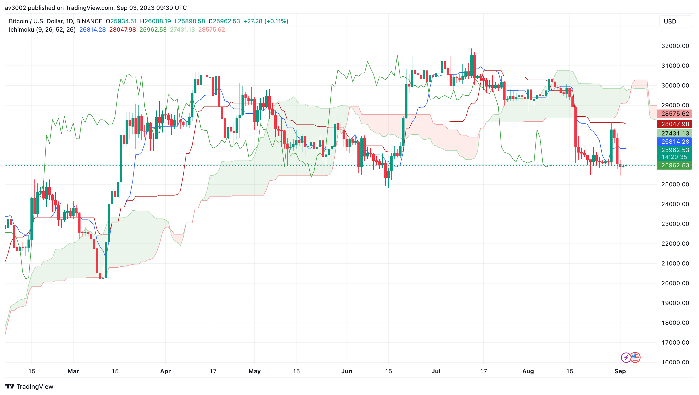
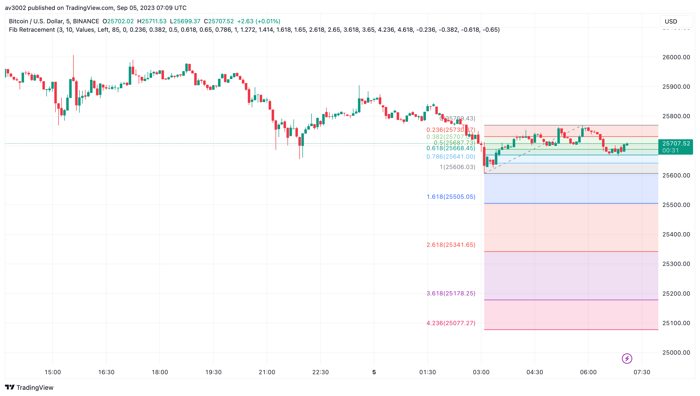
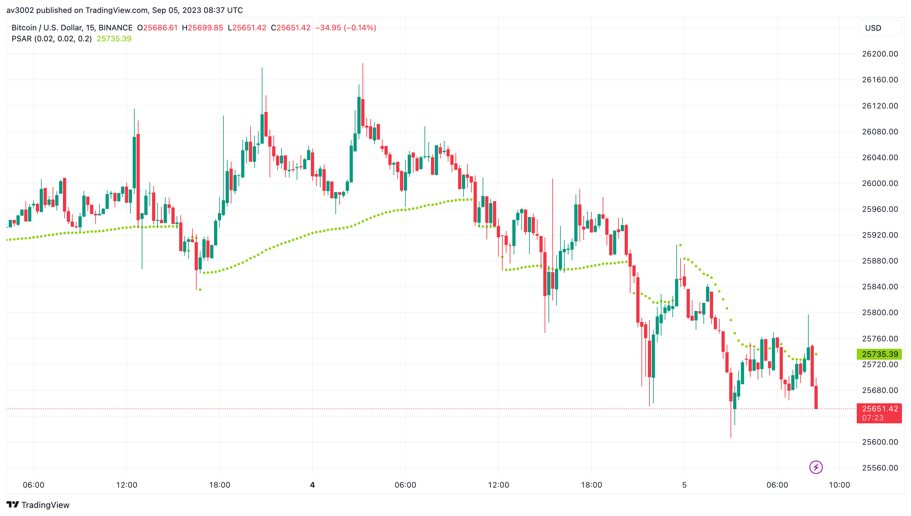
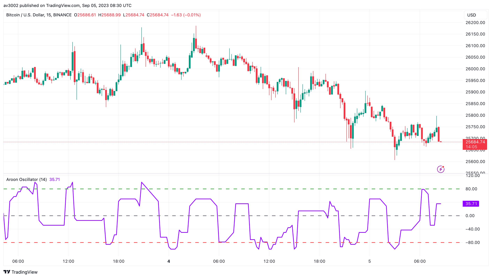
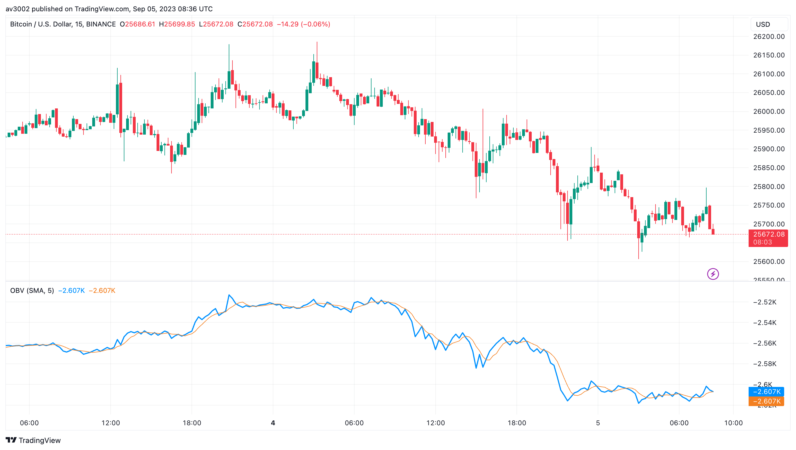

  <h1>📉 Advanced Level Indicators</h1>
  
Welcome to the Advanced Stock Market Technical Indicators Repository! In the world of stock trading and investment, having the right tools at your disposal is crucial for making informed decisions. Technical indicators play a pivotal role in analyzing price movements, identifying trends, and predicting potential market reversals. This repository aims to provide a comprehensive collection of advanced technical indicators that can empower traders and investors with valuable insights into the stock market.

## 📈 Indicators Included

This repository includes the following advanced technical indicators:

- 🌤️ **Ichimoku Cloud**
- 🔢 **Fibonacci Retracement**
- 🛑 **Parabolic SAR (Stop and Reverse)**
- 🔄 **Aroon Oscillator**
- 💹 **On-Balance Volume (OBV)**

## 📋 Indicator Descriptions

### Ichimoku Cloud

The Ichimoku Cloud is a comprehensive technical indicator that provides a visual representation of support, resistance, and trend strength. It consists of multiple components, including the Kijun-sen, Tenkan-sen, Senkou Span A and B, and the Chikou Span. The cloud's unique appearance on a TradingView chart can help traders assess potential market trends and reversals.

**Use Case:**
The Ichimoku Cloud helps traders identify the direction of a trend and assess its strength. It also provides potential support and resistance levels.

**How to Use:**
To use the Ichimoku Cloud indicator, follow these steps:
1. Understand the components of the Ichimoku Cloud, including the cloud itself, Tenkan-sen, Kijun-sen, Senkou Span A and B, and Chikou Span.
2. Observe the cloud's color and thickness. A bullish trend is indicated by a green cloud, while a bearish trend is indicated by a red cloud.
3. Use the positioning of price relative to the cloud, Tenkan-sen, and Kijun-sen to make trading decisions.
4. Look for potential support and resistance levels within the cloud.

### Fibonacci Retracement

Fibonacci Retracement is a powerful tool for identifying potential support and resistance levels based on key Fibonacci ratios, such as 23.6%, 38.2%, 50%, 61.8%, and 100%. These levels can act as price reversal points, helping traders make decisions on entry and exit points.

**Use Case:**
Fibonacci Retracement helps traders identify key levels where price may reverse or consolidate.

**How to Use:**
To use the Fibonacci Retracement indicator, follow these steps:
1. Identify a significant price swing (high to low or low to high) that you want to analyze.
2. Draw the Fibonacci retracement levels from the start to the end of the price swing.
3. Observe how price interacts with the Fibonacci levels. These levels can act as potential entry, exit, or stop-loss points.
4. Combine Fibonacci Retracement with other technical indicators for confirmation.

### Parabolic SAR (Stop and Reverse)

The Parabolic SAR is used to highlight potential trend reversals in price movements. It appears as a series of dots above or below the price chart, indicating potential entry and exit points based on the direction of the dots.

**Use Case:**
Parabolic SAR helps traders identify potential points where a trend may reverse.

**How to Use:**
To use the Parabolic SAR indicator, follow these steps:
1. Observe the position of Parabolic SAR dots relative to the price chart.
2. Dots above the price suggest a bearish trend, while dots below the price suggest a bullish trend.
3. When dots switch sides, it may signal a potential trend reversal.
4. Use Parabolic SAR in combination with other indicators to confirm reversal signals.

### Aroon Oscillator

The Aroon Oscillator is designed to determine the strength of a trend and identify potential trend reversals. It consists of two lines, Aroon Up and Aroon Down, which oscillate between 0 and 100. Traders can use these lines to gauge trend strength and potential shifts in market direction.

**Use Case:**
Aroon Oscillator helps traders assess the strength of a trend and potential trend reversals.

**How to Use:**
To use the Aroon Oscillator indicator, follow these steps:
1. Calculate the Aroon Up and Aroon Down lines based on a specified period (e.g., 14).
2. Aroon Up measures the strength of the bullish trend, while Aroon Down measures the strength of the bearish trend.
3. Pay attention to crossovers and extreme readings to identify potential trend reversals.
4. Use Aroon Oscillator in conjunction with other indicators for confirmation.

### On-Balance Volume (OBV)

The On-Balance Volume (OBV) indicator relates volume to price movements, helping traders identify buying and selling pressure. A rising OBV suggests accumulation, while a falling OBV indicates distribution.

**Use Case:**
OBV helps traders confirm the strength of a trend by analyzing volume and price movements.

**How to Use:**
To use the On-Balance Volume (OBV) indicator, follow these steps:
1. Calculate the OBV by adding volume on up days and subtracting volume on down days.
2. Observe the OBV line on the price chart.
3. Rising OBV suggests buying pressure and a strengthening trend, while falling OBV suggests selling pressure and a weakening trend.
4. Use OBV to confirm price trend directions and potential trend reversals.

## 🚀 Usage and Instructions

To use these indicators:
1. Open the TradingView Pine Script editor.
2. Copy the Pine Script code of the desired indicator from this repository.
3. Paste the code in the Pine Script editor.
4. Customize the indicator's parameters as needed.
5. Apply the indicator to your chart to visualize its signals.

Feel free to explore, modify, and integrate these indicators into your trading strategies. Happy trading!